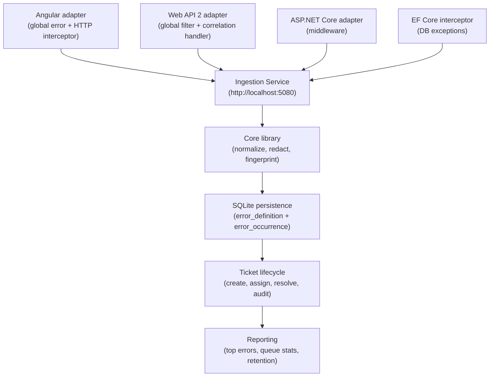

# Autonomous .NET Observability

A centralized, end-to-end **Error-to-Ticket Management Framework** for enterprise .NET and Angular ERP applications.

The framework captures errors from every layer of the stack — Angular, Web API 2 (.NET 4.7.2), ASP.NET Core (.NET 8), EF Core, and SQL — normalizes them through a shared core library, persists them to a dedicated database, and provides a complete ticket lifecycle with immutable audit history.

> **Project status:** Foundation and core phases implemented. Angular admin UI screens are the next planned addition.

---

## Quick Start

```powershell
# 1. Create and seed the database
.\docs\installation\scripts\setup-database.ps1

# 2. Build the .NET solution
.\docs\installation\scripts\build-solution.ps1

# 3. Start the ingestion service  (Swagger: http://localhost:5080/swagger)
.\docs\installation\scripts\start-ingestion-service.ps1

# 4. Run all automated tests
.\docs\installation\scripts\run-tests.ps1

# 5. Build the Angular library (requires Node.js 20+)
.\docs\installation\scripts\build-angular-library.ps1
```

---

## What Was Built

### Error Flow

```
Error Occurs → Global Adapter Captures → Core Normalizes & Redacts → Fingerprint Calculated
    → Ingestion Service Persists → Safe Reference Returned → User Sees Safe Message
        → User Clicks "Report Issue" → Ticket Created → Support Queue → Audit Trail
```

### Packages

| Package | Target | Purpose |
|---|---|---|
| `Company.ErrorManagement.Contracts` | .NET Standard 2.0 | Shared envelope, receipt, ticket contracts, and interfaces |
| `Company.ErrorManagement.Core` | .NET Standard 2.0 | Fingerprinting, redaction, normalization, reference generation |
| `Company.ErrorManagement.Persistence.Sqlite` | .NET 8 | SQLite repositories, migration runner, direct transport |
| `Company.ErrorManagement.AspNetCore` | .NET 8 | Correlation + exception middleware, DI extensions |
| `Company.ErrorManagement.EntityFrameworkCore` | .NET 8 | EF Core command interceptor for DB exception capture |
| `Company.ErrorManagement.WebApi2` | .NET 4.7.2 | Web API 2 global filter + correlation handler |
| `Company.ErrorManagement.IngestionService` | .NET 8 Web API | Central ingestion host — errors, tickets, reporting, retention |
| `@company/erp-error-angular` | Angular 20 | Global error handler, HTTP interceptor, ticket service |

---

## Key Capabilities

- **Non-invasive**: register once per app — no per-page, per-controller, or per-component changes.
- **Deduplication**: SHA-256 fingerprint groups repeated errors into one definition; each request creates a separate occurrence.
- **Safe error responses**: stack traces, SQL messages, and connection strings never reach the browser.
- **Failure isolation**: framework failures never interrupt the host application's normal operation.
- **Complete ticket lifecycle**: NEW → TRIAGE → ASSIGNED → INVESTIGATING → RESOLVED → CLOSED with immutable audit history.
- **Retention**: configurable archiving job removes old occurrences on a schedule.
- **Correlation**: `X-Correlation-ID` flows from Angular through every API and is written to every occurrence and ticket record.

---

## Repository Structure

```
src/
  Company.ErrorManagement.Contracts/      .NET Standard 2.0 — shared types
  Company.ErrorManagement.Core/           .NET Standard 2.0 — core logic
  Company.ErrorManagement.Persistence.Sqlite/  .NET 8 — SQLite persistence
  Company.ErrorManagement.AspNetCore/     .NET 8 — Core middleware
  Company.ErrorManagement.EntityFrameworkCore/  .NET 8 — EF Core interceptor
  Company.ErrorManagement.WebApi2/        .NET 4.7.2 — Web API 2 adapter
  Company.ErrorManagement.IngestionService/    .NET 8 Web API — central host
  angular/erp-error-angular/             Angular 20 npm library

database/
  migrations/
    V001__initial_schema.sql             Errors, tickets, audit, SLA, config
    V002__observability_metadata.sql     Monitoring, recovery, diagnostics
  seed/
    seed_reference_data.sql             Environments, severities, queues, statuses

tests/
  Company.ErrorManagement.Core.Tests/
  Company.ErrorManagement.Persistence.Sqlite.Tests/
  Company.ErrorManagement.AspNetCore.Tests/

docs/
  installation/
    README.md                           Full installation and integration guide
    scripts/
      setup-database.ps1               Create DB, apply migrations, seed data
      build-solution.ps1               Restore and build .NET solution
      start-ingestion-service.ps1      Start the ingestion service
      run-tests.ps1                    Run all test projects
      build-angular-library.ps1        Compile the Angular npm library
  03_Implementation_Architecture_and_Delivery_Plan.md
```

---

## Integration in 3 Steps

### Angular 20

```typescript
// app.config.ts — one change, nothing else needed
export const appConfig: ApplicationConfig = {
  providers: [
    provideHttpClient(
      withInterceptors([erpCorrelationInterceptor, erpErrorHttpInterceptor])
    ),
    provideErpErrorManagement({
      applicationName: 'MainERP',
      environment: 'PROD',
      clientErrorEndpoint: '/api/error-management/client-errors',
    }),
  ],
};
```

### ASP.NET Web API 2 (.NET 4.7.2)

```csharp
// WebApiConfig.cs — add after existing setup
ErrorManagementConfig.Register(config, reporter, correlationContext, options => {
    options.ApplicationName = "MainERP";
    options.EnvironmentName = "Production";
});
```

### ASP.NET Core (.NET 8)

```csharp
// Program.cs
builder.Services.AddErpErrorManagement(o => { o.ApplicationName = "ModernERP"; o.EnvironmentName = "Production"; });
builder.Services.AddErrorManagementSqlite(o => { o.ConnectionString = connectionString; });
app.UseErpCorrelation();
app.UseErpExceptionHandling();
```

---

## REST API (Ingestion Service)

| Method | Endpoint | Description |
|---|---|---|
| `POST` | `/api/error-management/events` | Ingest a server error |
| `POST` | `/api/error-management/client-errors` | Ingest an Angular error |
| `POST` | `/api/tickets` | Create a ticket |
| `GET` | `/api/tickets/{id}` | Get ticket |
| `GET` | `/api/tickets` | Search tickets |
| `POST` | `/api/tickets/{id}/assign` | Assign ticket |
| `POST` | `/api/tickets/{id}/status` | Change status |
| `POST` | `/api/tickets/{id}/comments` | Add comment |
| `POST` | `/api/tickets/{id}/resolve` | Resolve ticket |
| `GET` | `/api/tickets/{id}/history` | Status audit trail |
| `GET` | `/api/reports/top-errors` | Top recurring errors |
| `GET` | `/api/reports/queue-stats` | Ticket counts by queue and status |
| `GET` | `/health` | Health check |

---

## Detailed Documentation

See **[docs/installation/README.md](docs/installation/README.md)** for:
- Full prerequisites list
- Step-by-step database, service, Angular, Web API 2, and .NET 8 setup
- All configuration options
- Schema upgrade instructions
- Troubleshooting common problems

---

## Architecture Overview



---

## Technology Targets

- Angular 20.x
- ASP.NET Web API 2 / .NET Framework 4.7.2
- ASP.NET Core / .NET 8
- Entity Framework Core 8
- SQLite (initial); SQL Server or PostgreSQL (production upgrade path)
- Windows Server / IIS
- Docker / Kubernetes (future)

---

## License

Licensed under the [Apache License 2.0](LICENSE).
