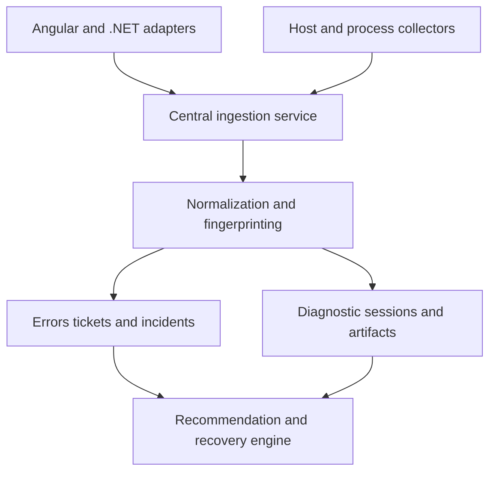

# Autonomous .NET Observability

A centralized observability, error-management, and controlled self-healing framework for enterprise .NET applications.

The framework supports mixed environments containing ASP.NET Web API 2 on .NET Framework, modern .NET services, Angular clients, SQL databases, Windows Server, IIS, containers, and Kubernetes.

> **Project status:** Architecture and foundation development. Interfaces and database structures may change before the first stable release.

## Purpose

Enterprise applications commonly use separate solutions for exception logging, infrastructure monitoring, memory-dump collection, incident tracking, and recovery. This separation makes it difficult to understand what happened before a failure and determine whether a recovery action resolved the underlying problem.

Autonomous .NET Observability connects application errors, logs, traces, process metrics, diagnostic artifacts, incidents, support tickets, and recovery actions through common event and correlation identifiers.

## Key Capabilities

* Capture Angular, HTTP, API, business-layer, EF Core, and database errors.
* Correlate failures across requests, services, application instances, and pods.
* Prevent duplicate storage when the same event is retried.
* Group recurring failures using centralized error fingerprinting.
* Monitor process memory, CPU, thread pressure, request latency, failures, and dependency performance.
* Start bounded diagnostic sessions when sustained thresholds are exceeded.
* Temporarily enable detailed logging for a configured duration.
* Capture traces and memory dumps under controlled limits.
* Create incidents and support tickets with complete audit history.
* Generate evidence-based recovery recommendations.
* Execute approved and guarded recovery actions.
* Support instance restarts and dependency-specific circuit breaking.
* Continue application logging when the central service is unavailable.

## Architecture



Application instances continue writing their normal logs and traces. Application adapters send normalized events to the central service asynchronously.

If the central service becomes unavailable, the application continues running and writing its local logs. Central delivery is paused through a circuit breaker, while important events remain in a bounded durable spool for later replay.

A failure in the observability framework must never interrupt the original application operation.

## Error Identity and Deduplication

The framework uses three different identifiers:

| Identifier       | Purpose                                                                                   |
| ---------------- | ----------------------------------------------------------------------------------------- |
| `event_id`       | Identifies one failure event and prevents duplicate storage when delivery is retried.     |
| `fingerprint`    | Groups different occurrences of the same normalized error pattern.                        |
| `correlation_id` | Connects a request across Angular, APIs, services, database operations, logs, and traces. |

The central service calculates the authoritative fingerprint.

Request IDs, timestamps, user identifiers, generated values, and unstable stack-trace line numbers are excluded from fingerprint calculation.

If the same `event_id` is delivered more than once, only one occurrence is stored. If the same error happens during separate requests, each request creates an occurrence, but all occurrences are grouped under the same error definition.

## Main Components

| Component                 | Responsibility                                                                                              |
| ------------------------- | ----------------------------------------------------------------------------------------------------------- |
| Angular adapter           | Global error handling, HTTP interception, correlation propagation, safe notifications, and issue reporting. |
| Web API 2 adapter         | Global exception capture and safe error responses for .NET Framework 4.7.2 applications.                    |
| ASP.NET Core adapter      | Middleware, dependency injection, Problem Details integration, and modern .NET diagnostics.                 |
| Error Management Core     | Redaction, normalization, classification, fingerprinting, and error-reference generation.                   |
| Central ingestion service | Idempotent event ingestion, occurrence storage, ticketing, incidents, and administrative APIs.              |
| Monitoring collectors     | Windows Performance Monitor, ETW, modern .NET runtime metrics, application logs, and traces.                |
| Diagnostic engine         | Threshold evaluation, detailed logging, trace collection, memory dumps, quotas, and retention.              |
| Recovery engine           | Recommendations, approvals, recovery actions, cooldowns, verification, rollback, and auditing.              |

## Threshold-Triggered Diagnostics

A monitoring rule contains a threshold and a sustained evaluation window. Short-lived spikes do not start expensive diagnostic collection.

When a threshold remains breached, the system can:

1. Open a monitoring incident.
2. Preserve the configured pre-trigger log context.
3. Increase diagnostic logging for 15–20 minutes.
4. Capture an initial trace or memory dump.
5. Capture a limited number of additional dumps at configured intervals.
6. Store artifact references, checksums, sizes, access classifications, and retention dates.
7. Restore the normal logging level automatically when the diagnostic session expires.

Raw log streams, metric time series, traces, and memory-dump files are not stored inside SQLite. They are stored in protected telemetry or artifact storage. SQLite stores their references and lifecycle metadata.

## Controlled Recovery

Recovery begins with an evidence-based recommendation.

Initially, recovery actions should require operator approval. Each action targets one application instance or one explicitly configured dependency.

Every action records:

* Target and reason.
* Supporting incident evidence.
* Requester and approver.
* Preconditions.
* Idempotency key.
* Before-and-after health measurements.
* Cooldown and stop conditions.
* Execution outcome.
* Rollback status.

A restart that does not improve the relevant health measurements must not produce a restart loop.

Circuit breakers are integrated into application dependency clients. Central configuration can control them, but they apply only to explicitly configured database operations or external services. Recovery probes determine when normal traffic can resume.

## Central Service Availability

The central service is responsible for:

* Event ingestion.
* Authoritative fingerprint calculation.
* Deduplication.
* Error grouping.
* Ticket management.
* Incident orchestration.
* Diagnostic-session management.
* Recovery recommendations and actions.

If the central service is unavailable:

1. Applications continue writing their normal logs and traces.
2. Business requests continue without waiting for central logging.
3. The transport circuit breaker stops repeated delivery attempts.
4. Important events remain in a durable local spool.
5. Recovery probes periodically check the central service.
6. Queued events are replayed when the service becomes available.
7. The central database ignores duplicate events using the unique `event_id`.

## Persistence

The initial implementation uses one dedicated SQLite database owned by the central ingestion service.

Application pods must not write directly to the SQLite file. All application instances send their events to the central service.

The database is delivered through ordered migrations:

* `ERP_ErrorManagement_SQLite_v1.sql` creates error, occurrence, ticket, audit, configuration, SLA, retention, and schema-version objects.
* `ERP_ErrorManagement_SQLite_v2_Observability_Metadata.sql` creates monitored instances, rules, incidents, diagnostic sessions, artifacts, recommendations, recovery actions, and incident events.

The persistence layer uses repository interfaces so SQLite can later be replaced with SQL Server or PostgreSQL.

A production deployment requiring multiple ingestion-service replicas or high write concurrency should use SQL Server or PostgreSQL instead of SQLite.

## Technology Targets

* Angular 20.x
* ASP.NET Web API 2
* .NET Framework 4.7.2
* ASP.NET Core
* Modern .NET
* Entity Framework Core
* SQL Server and PostgreSQL application databases
* Windows Server and IIS
* Docker and Kubernetes
* SQLite for the initial central repository

## Security Principles

* Redact passwords, tokens, cookies, authorization headers, connection strings, and sensitive fields before transport.
* Do not capture request bodies, response bodies, or SQL parameter values by default.
* Restrict technical diagnostics to authorized support and engineering users.
* Treat memory dumps as restricted data because they may contain credentials or personal information.
* Apply artifact size, count, access, and retention limits.
* Keep credentials in the host secret store instead of the framework database.
* Ensure that failures in logging, monitoring, or persistence do not replace the original application response.

## Planned Repository Structure

```text
src/
  contracts/
  core/
  ingestion-service/
  persistence-sqlite/
  webapi2-adapter/
  aspnetcore-adapter/
  monitoring-agent/
  diagnostics/
  recovery/
  angular/

database/
  migrations/

tests/
  unit/
  integration/
  compatibility/

docs/
  architecture/
  deployment/
  security/
```

## Delivery Plan

The project will be delivered as one integrated release through internal development checkpoints:

1. Architecture proof of concept and central ingestion.
2. Complete SQLite schema and repository layer.
3. Normalization, redaction, fingerprinting, and durable event delivery.
4. Web API 2, ASP.NET Core, Angular, and database adapters.
5. Ticketing, auditing, reporting, and administration.
6. Host and process monitoring.
7. Threshold-triggered diagnostic capture.
8. Recommendations and guarded recovery.
9. Security, resilience, performance, compatibility, and rollout validation.

There is no error-only production release. The initial release is complete only after both error-management and monitoring/recovery acceptance criteria pass.

## Contributing

The contribution workflow will be documented after the initial repository structure and public interfaces become stable.

Until then, use GitHub issues to propose features, report defects, or discuss architectural decisions.

## License

Licensed under the [Apache License 2.0](LICENSE).
