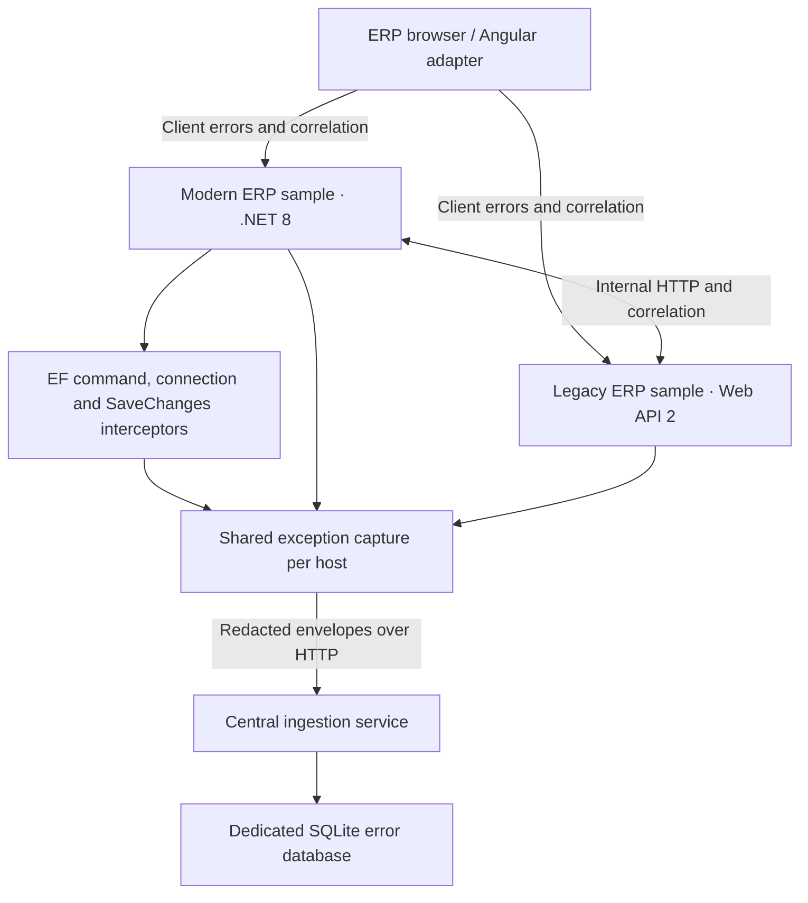

# Phase 4 — Backend adapters and demonstration hosts

Status: implementation prepared; build, runtime demonstration and tests are deferred at the user's request. Completion criteria are **not yet verified**. This branch starts from the merged Phase 1/HTTP transport changes and contains only Phase 4 plus the integration fixes needed by the samples.

## Runtime architecture



The ERP hosts reference adapters and HTTP transport; they do not reference the SQLite persistence project. The modern sample's local SQLite database represents business data for intentional EF failures and is separate from the central error database. Both samples use registered codes `ERP` / `DEV`, distinguished by application version (`phase4-modern` / `phase4-legacy`).

## Implementation

| Task | Delivered |
|---|---|
| Web API 2 startup and DI | `ErrorManagementConfig.RegisterHttp` configures HTTP delivery, a correlation handler, a global exception logger/handler, and a resolver decorator for the client-error controller and reporting interfaces. Existing host services resolve through the original container. |
| Modern startup | `AddErpErrorManagementHttp` configures transport and capture with options validation. `MapErpClientErrors` forwards browser errors using server-owned application/environment/user context. |
| Explicit capture | Inject `IExceptionReporter` and call `ReportAsync` for handled exceptions and background operations. |
| EF interception | `AddErpDatabaseInterception` and `AddErpErrorInterceptors` attach command, connection, and SaveChanges failure callbacks, with both synchronous and asynchronous support. |
| Provider metadata | SQL Server (both SqlClient providers), PostgreSQL, SQLite and MySQL metadata mappings; generic DbException fallback. No SQL parameter values or connection strings are read by the mapper. |
| Correlation | Validated incoming IDs, response echo, scoped ambient state and an opt-in outgoing HTTP handler for internal API boundaries. |
| Shared capture | Inner exception identity plus correlation ID coalesces repeated EF/wrapper/global captures within one host into a single task and receipt. First capture supplies the diagnostic context. |
| Multiple hosts | Error references now use a GUID suffix rather than process-local counters, avoiding collisions between applications and after restarts. Treat references as opaque strings. |
| Safe responses | Technical details remain in the envelope; public responses contain safe messages and references. Client-error forwarding returns 503 if persistence is unavailable. Client identity comes from the authenticated host principal, not a submitted user ID. |

The legacy registration installs the single global `IExceptionHandler` slot. If the host already uses a custom handler, compose that behavior explicitly. The legacy compatibility exception filter remains available but is not additionally registered by `RegisterHttp`.

The modern registration creates a host-wide `IExceptionReporter`; use this shared registration for middleware and EF. Manually constructing independent reporters bypasses in-process coalescing. Background operations should create a fresh correlation scope; exceptions deliberately reused under a different scope create separate events.

## Start the demonstration environment later

Prerequisites: Windows for the legacy OWIN console, .NET 8 SDK/runtime for the service and modern host, .NET Framework 4.7.2 runtime (or a compatible installed 4.x runtime). A disposable SQL Server database is optional for the legacy SQL endpoints. No ERP business schema is modified.

Run these in three terminals from the repository root when ready for validation:

```powershell
# Terminal 1 — central service, loopback only
$env:ASPNETCORE_URLS = "http://127.0.0.1:5070"
dotnet run --project src/Company.ErrorManagement.IngestionService --no-launch-profile

# Terminal 2 — modern ERP, port 5080
dotnet run --project samples/ModernErp

# Terminal 3 — legacy ERP, port 5081
# Optional: set a LOCAL/DISPOSABLE database connection through your environment.
# $env:DEMO_SQLSERVER_CONNECTION = "..."
dotnet run --project samples/LegacyErp
```

For HTTP.sys access-denied errors, an administrator can grant the current Windows user the exact loopback URL reservation once:

```powershell
netsh http add urlacl url=http://127.0.0.1:5081/ user="$env:USERDOMAIN\$env:USERNAME"
```

The central service publishes its migrations and seed scripts into its output directory and resolves their relative paths from that directory. It creates the dedicated error database using its configured connection string. The modern sample creates `modern-demo.db` in its working directory.

To use a different central endpoint, set `Observability__Endpoint` for modern ERP and `OBSERVABILITY_ENDPOINT` for legacy ERP. Both are full ingestion URLs ending in `/api/error-management/events`. HTTPS is required outside loopback by the HTTP transport.

## Failure-path matrix (not executed)

| Request | Expected behavior |
|---|---|
| GET `/api/demo/controller` on either host | Unhandled controller exception; safe 500; central occurrence and reference. |
| GET `/api/demo/business` on either host | Unhandled business exception reaches global handling. |
| GET `/api/demo/timeout` on either host | Synthetic TimeoutException; timeout/transient metadata. |
| GET `/api/demo/database` on modern | Actual SQLite missing-table error captured through EF command interception. |
| POST `/api/demo/savechanges` on modern | Actual unique-constraint violation; command and SaveChanges callbacks plus middleware share one receipt. |
| GET `/api/demo/connection` on modern | Actual connection failure to a missing parent directory; connection interceptor captures it. |
| GET `/api/demo/database` on legacy | Actual SQL Server THROW with error number 51000; requires configured disposable SQL Server. |
| GET `/api/demo/database-timeout` on legacy | SQL command timeout using WAITFOR and a 1-second command timeout; requires SQL Server. |
| GET `/api/demo/handled` on either host | Handled exception is explicitly reported; business fallback response remains successful. |
| GET `/api/demo/legacy` on modern | Modern-to-legacy HTTP boundary preserves correlation and forwards the downstream safe response. |
| GET `/api/demo/modern` on legacy | Legacy-to-modern HTTP boundary preserves correlation and forwards the downstream safe response. |
| POST `/api/error-management/client-errors` on either host | Host-owned application and identity context; forward to central ingestion. |

Example requests for the later demonstration:

```powershell
curl.exe -i -H "X-Correlation-ID: phase4-demo-001" http://127.0.0.1:5080/api/demo/legacy
curl.exe -i -H "X-Correlation-ID: phase4-demo-002" http://127.0.0.1:5081/api/demo/modern
curl.exe -i -X POST http://127.0.0.1:5080/api/demo/savechanges
```

Client-error JSON (the optional event ID should be reused only for retries of that same event):

```json
{
  "eventId": "browser-demo-unique-event-id",
  "message": "Browser demonstration failure",
  "exceptionType": "TypeError",
  "url": "/orders",
  "module": "Orders"
}
```

Enable one background failure at startup with `Demo__RunBackgroundFailure=true` for modern ERP or `DEMO_BACKGROUND_FAILURE=1` for legacy ERP. Those flags are off by default.

To inspect central persistence later, open its configured SQLite database and run:

```sql
SELECT o.error_reference, o.event_id, o.correlation_id, o.application_version,
       d.layer, d.exception_type, o.db_provider, o.db_error_code,
       o.db_procedure, o.db_line_number, o.is_timeout
FROM error_occurrence o
JOIN error_definition d ON d.error_definition_id = o.error_definition_id
ORDER BY o.received_at_utc DESC;
```

Expected acceptance: the response correlation ID matches the caller's valid supplied ID; the response reference matches an occurrence; both application versions appear; the EF failure contributes one occurrence even when it reaches middleware. Verify the service-down path separately: the ERP keeps its original safe response and returns `canReportIssue=false` when no persistence receipt exists.

## Real-host integration

Modern startup:

```csharp
services.AddErpErrorManagementHttp(
    o => { o.ApplicationName = "ERP"; o.EnvironmentName = "DEV"; },
    o => { o.Endpoint = new Uri(ingestionUrl); });
services.AddErpDatabaseInterception();
services.AddDbContext<ErpDbContext>((sp, o) => {
    o.UseSqlServer(businessConnection);
    o.AddErpErrorInterceptors(sp);
});
services.AddHttpClient("internal-api").AddErpCorrelationPropagation();

// After host authentication has established the principal:
app.UseErpCorrelation();
app.UseErpExceptionHandling();
app.MapErpClientErrors().RequireAuthorization();
```

Legacy startup (configure the ERP DI resolver before this call):

```csharp
ErrorManagementConfig.RegisterHttp(config,
    o => { o.ApplicationName = "ERP"; o.EnvironmentName = "DEV"; },
    o => { o.Endpoint = new Uri(ingestionUrl); });
```

Handled/background operation:

```csharp
using (CorrelationIds.BeginScope(correlationContext))
{
    try { await RunJobAsync(); }
    catch (Exception ex)
    {
        await exceptionReporter.ReportAsync(ex,
            new ErrorCaptureContext { Layer = ErrorLayer.BackgroundJob, Module = "ImportJob" });
        // Apply your business retry/fallback policy separately.
    }
}
```

## Boundaries and remaining work

- No build, server launch, HTTP demonstration or test execution has been performed for this change.
- Direct HTTP delivery still awaits bounded attempts. Synchronous EF callbacks wait for capture to finish; durable background delivery is Phase 2 work, not claimed here.
- SQL Server/PostgreSQL/MySQL mapping code is present; only the SQL Server and SQLite sample paths are supplied. Actual provider runs remain deferred.
- Cancellation requested by the caller is not treated as an unexpected request failure. Command cancellation is not assumed to mean a timeout.
- After a response starts, the middleware cannot replace it safely; it captures and rethrows so the host terminates the response.
- The samples intentionally expose fault endpoints and are bound to loopback. Apply existing ERP authentication, authorization, CORS and rate limits to client-error endpoints before deployment. Central service authentication is still Phase 3 work.
- Upstream proxies forwarding an existing safe error response should forward it without calling `EnsureSuccessStatusCode`; this avoids creating a new exception for an already-reported downstream error.
