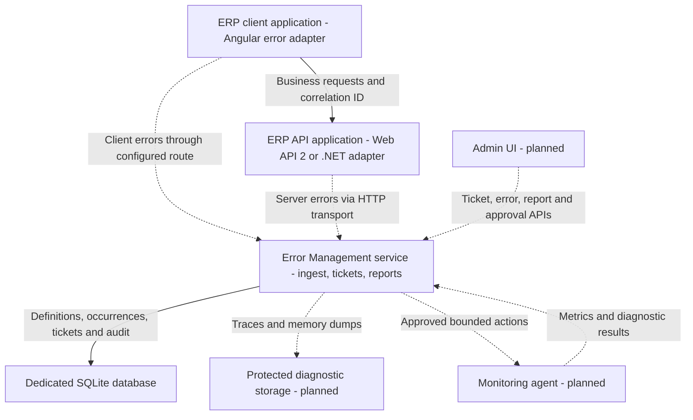

# Runtime Application Architecture and Design Alignment

This page compares the current repository with [the original framework proposal](./02_Dynamic%20Enterprise%20Error%20Management%20and%20Ticketing%20Framework_V2%20(1).docx) and [the implementation plan](./03_Implementation_Architecture_and_Delivery_Plan.md). It describes a deployment in which an existing ERP application reports errors to a central service and support staff use a separate administration UI.

Review basis: source inspected on 23 September 2026 (Git tree `378b8fa4af42b16ab9908564d9ddb189474b77aa`). This is a source review; the applications were not built or run during this review. Later commits may change the status described below.

**Status:** foundation implemented; the complete environment below is a target architecture. The repository contains one deployable application today: `Company.ErrorManagement.IngestionService`. The Angular and .NET adapters are reusable libraries. It does not contain an ERP host application, Admin UI application, or monitoring agent.

## Applications and ownership

| Runtime component | Ownership and deployment | Current repository status |
| --- | --- | --- |
| ERP client application | Existing Angular ERP web application, deployed by its owner; installs `@company/erp-error-angular` | Adapter library exists; no sample or production client application in this repository |
| ERP API application | Existing Web API 2 or ASP.NET Core host; installs the appropriate adapter and optional EF Core interceptor | Adapter libraries exist; no host application or HTTP transport from a host to the central service |
| Error Management service | Separate .NET 8 API process, `Company.ErrorManagement.IngestionService` | Implemented: ingestion, ticket, reporting, health, retention, SQLite persistence |
| Admin UI | Separate support/engineering web application using the service APIs | Planned; no UI project or screens |
| Monitoring and diagnostics agent | Optional process or sidecar per host, when runtime monitoring and recovery are added | Planned; only supporting database metadata exists |
| Error Management database | Dedicated persistence owned by the central service | SQLite migrations and repositories implemented; SQL Server provider is not implemented |

The ERP client and ERP API may be deployed as one product, but they remain separate browser and server runtimes. The first complete environment therefore has four application runtimes: ERP client, ERP API, central service, and Admin UI. Monitoring adds an agent process. Only the central service executable is present in this repository today.

## Application interaction in the target environment

Solid arrows represent implemented API or library behavior, or ordinary ERP request traffic. Dashed arrows indicate integration or a component that remains to be built. A client error endpoint must be routed and secured as part of ERP integration; an existing ERP API may proxy that request.

### Request and error path

1. The Angular adapter adds `X-Correlation-ID` to business requests. The ERP API adapter carries that ID into an error envelope and returns a safe error reference when an unhandled exception occurs.
2. A true client-side error is posted to the configured client error endpoint. The existing Web API 2 package provides one such route; the central service also exposes `POST /api/error-management/client-errors`. Integration must select an endpoint, align its request contract, and route it securely.
3. The desired central deployment sends server-side errors from each ERP API instance to `POST /api/error-management/events`. **This connection is not implemented:** the current `IErrorTransport` implementation writes directly to SQLite. Application pods should not share or write the central SQLite file.
4. The central service normalizes and redacts an accepted envelope, calculates its fingerprint, writes error definitions and occurrences, and returns an error reference. The client should show only the safe message and reference; an HTTP error already carrying a reference is not reported a second time by the Angular interceptor.
5. A user can request a ticket using its error reference. The service implements create, search, assignment, status changes, comments, resolution, history, top errors, and queue statistics. An Admin UI to use these endpoints is not yet present.
6. The ERP continues its ordinary logging when central delivery fails. The intended nonblocking HTTP transport, bounded durable spool, replay, and delivery circuit breaker still need implementation and validation.

## Alignment with the proposal

| Proposed capability | What is in the repository | Alignment |
| --- | --- | --- |
| Global Angular, Web API 2, ASP.NET Core, and EF Core interception | Reusable adapters, middleware, handler/filter, and EF Core command failure interceptor | Foundation present; host integration and end-to-end verification pending |
| Normalization, redaction, correlation, fingerprint, safe reference | Contracts and core library, API middleware/filter, Angular interceptors | Implemented in code; validate representative full-stack paths |
| Central error and ticket persistence | .NET 8 ingestion service, SQLite repositories, migrations, ticket and reporting endpoints | Implemented foundation; original document specifies embedded SQL Server, so deployment model and database choice differ |
| Admin search, queues, ticket workflow, audit, reporting | Service endpoints and persistence; no Admin UI project | Backend partial, UI missing |
| User-friendly notification and Report Issue dialog | Angular reporting and ticket services; no modal or complete issue-reporting component | Partial |
| Log/trace monitoring, threshold diagnostics, dumps, incident and guarded recovery | SQLite metadata tables in `V002__observability_metadata.sql`; no collectors, artifact store, runtime APIs, or recovery executor | Schema only |
| Resilience with local logging, durable spool, and replay | Error reporter catches its own failures; host logging remains outside this library | Durable delivery, replay, and circuit breaker missing |
| Administrative security and safe production deployment | Redaction code exists; API startup has no visible authentication or role authorization | Production security work pending |

### Design choices to reconcile

- The original document's first deployment uses an **embedded library with a separate SQL Server database**; remote ingestion is described as a later option. The README and installation guide now present a **central .NET 8 service with SQLite**. The diagram follows the central-service direction requested for this environment. Update the older proposal or add a formal decision record before treating these as one agreed deployment design.
- `Company.ErrorManagement.Persistence.Sqlite` currently registers `DirectSqlErrorTransport`. Implement an HTTP transport for Web API 2 and .NET 8 hosts, with bounded delivery and idempotent replay, before saying all ERP instances report centrally.
- The Angular reporting service sends a string `layer` value, while the central endpoint binds a .NET enum with default JSON settings. Verify and align the request contract before routing the Angular library directly to the central endpoint.
- `event_id` is unique on occurrences, but `ErrorRepository.UpsertAsync` increments the definition count before it attempts the occurrence insert. A retried event can therefore inflate `occurrence_count` even when the unique constraint prevents another occurrence; correct this before relying on frequency reports.
- The Admin UI, role-protected technical views, monitoring agent, diagnostic artifact store, and recovery control plane are still future work. The metadata migration alone does not make those features operational.

## Source map

- Service routes and startup: `src/Company.ErrorManagement.IngestionService/`
- Core processing and contracts: `src/Company.ErrorManagement.Core/`, `src/Company.ErrorManagement.Contracts/`
- Host adapters: `src/Company.ErrorManagement.WebApi2/`, `src/Company.ErrorManagement.AspNetCore/`, `src/Company.ErrorManagement.EntityFrameworkCore/`
- Angular adapter: `src/angular/erp-error-angular/`
- Current transport and repositories: `src/Company.ErrorManagement.Persistence.Sqlite/`
- Schema and planned monitoring metadata: `database/migrations/`
